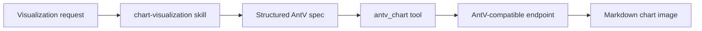

# dsh-plugin-chart

English | [简体中文](README.zh-CN.md)

An unofficial community plugin for [DeepSeek Harness](https://github.com/deepseek-ai/deepseek-harness) that embeds an adaptation of AntV's [`chart-visualization`](https://github.com/antvis/chart-visualization-skills/tree/master/skills/chart-visualization) skill and adds a native `antv_chart` tool.

The skill helps the model select and structure 24 chart types. The tool calls the AntV-compatible GPT-Vis endpoint with cancellation, timeout, response-size limits, response validation, and Markdown image rendering. Users do not need to copy `SKILL.md` files or ask the model to run `curl`.

> [!IMPORTANT]
> This project is not affiliated with or endorsed by DeepSeek or AntV. DeepSeek Harness is currently a developer preview and may introduce breaking plugin APIs.

## How it works



The installable bundle contributes two registrations:

- `chart-visualization`: model- and user-invocable skill provider backed by content embedded in the plugin module.
- `antv_chart`: model-facing tool that posts a validated chart specification and renders the returned image URL.

## Requirements

- Node.js `^22.19.0` or `>=24.0.0`
- pnpm on `PATH` (required by `dsh plugin`)
- DeepSeek Harness `0.1.0-rc.7` through the current `0.1.x` developer preview

## Install

From npm after the package is published:

```sh
dsh plugin --profile web add dsh-plugin-chart
```

From this checkout during development:

```sh
git clone <your-repository-url> dsh-plugin-chart
cd dsh-plugin-chart
pnpm install
dsh plugin --profile web add .
```

DeepSeek Harness anchors `add .` to the invoking checkout and automatically adds this package's `cordis.patch.yml` to the selected profile's bundle stack.

Current developer-preview releases may print pnpm warnings that the `@deepseek-ai/cordis`, `@deepseek-ai/dsh-skill`, and `@deepseek-ai/dsh-tools` peers are missing from the profile itself. The Harness launcher supplies those host packages through its maintained `$DSH_HOME/profiles/node_modules` fallback; do not add duplicate copies solely to silence the warning. Confirm installation with `dsh --profile web --dump-config` and look for the enabled `dsh-chart` row.

Start the profile:

```sh
dsh web
```

Remove the plugin with:

```sh
dsh plugin --profile web remove dsh-plugin-chart
```

## Use

Ask naturally:

```text
Create a line chart for monthly active users: Jan 120, Feb 148, Mar 173.
```

Or invoke the skill explicitly:

```text
/chart-visualization Compare product revenue: Alpha 42, Beta 31, Gamma 27.
```

The model loads the skill, calls `antv_chart`, and returns a Markdown image. The tool currently supports:

`area`, `bar`, `boxplot`, `column`, `dual-axes`, `fishbone-diagram`, `flow-diagram`, `funnel`, `histogram`, `liquid`, `line`, `mind-map`, `network-graph`, `organization-chart`, `pie`, `radar`, `sankey`, `scatter`, `spreadsheet`, `treemap`, `venn`, `violin`, `waterfall`, and `word-cloud`.

## Configuration

The default endpoint is `https://antv-studio.alipay.com/api/gpt-vis`. Override the bundle row in `$DSH_HOME/profiles/web/cordis.patch.yml` when using a private compatible gateway or different limits:

```yaml
- id: dsh-chart
  config:
    endpoint: https://charts.example.com/api/gpt-vis
    requestTimeoutMs: 30000
    maxResponseBytes: 65536
```

| Field              |                      Default | Description                                                                                                                       |
| ------------------ | ---------------------------: | --------------------------------------------------------------------------------------------------------------------------------- |
| `endpoint`         | AntV public GPT-Vis endpoint | HTTP(S) endpoint receiving the chart specification. HTTP is allowed for local development. Embedded URL credentials are rejected. |
| `requestTimeoutMs` |                      `30000` | Positive request timeout, up to `300000`. The fetch operation cooperates with Harness cancellation.                               |
| `maxResponseBytes` |                      `65536` | Maximum response body size from `1024` through `10485760`.                                                                        |

The plugin always overwrites the outbound `source` field with `chart-visualization-skills`, as required by the upstream API contract.

## Data and privacy

The tool sends the full `spec` object to the configured endpoint. Do not include passwords, access tokens, private keys, government identifiers, full personal contact details, or unnecessary sensitive business records. Aggregate or anonymize data, or configure a private compatible endpoint.

No API credential is read or transmitted by this plugin. Generated image URLs may be hosted by the configured service and follow that service's retention and access policy.

## Development

```sh
pnpm install
pnpm check
```

Useful commands:

| Command              | Purpose                                                               |
| -------------------- | --------------------------------------------------------------------- |
| `pnpm test`          | Run unit and registry integration tests.                              |
| `pnpm test:coverage` | Run tests with coverage thresholds.                                   |
| `pnpm typecheck`     | Type-check source and tests in strict mode.                           |
| `pnpm build`         | Emit ESM JavaScript and declarations.                                 |
| `pnpm format`        | Format project files with Prettier.                                   |
| `pnpm check`         | Run formatting, type checks, coverage, build, and package validation. |

The integration test mounts the real `SkillRegistry`, `SystemPrompt`, and `ToolRuntime` services, loads the embedded skill, then dispatches `antv_chart` against a mocked HTTP endpoint.

## Upstream synchronization

The embedded skill content in `src/skill.ts` is adapted from AntV's MIT-licensed `skills/chart-visualization/SKILL.md`. The pinned source commit is recorded in the source and in [`THIRD_PARTY_NOTICES.md`](THIRD_PARTY_NOTICES.md).

## Release

1. Update the version in `package.json`.
2. Run `pnpm check` and `npm pack --dry-run`.
3. Publish the generated package when the repository and npm package are configured.

Before publishing, add your repository URL and issue tracker to `package.json`.

## License

[MIT](LICENSE). Third-party attribution is in [THIRD_PARTY_NOTICES.md](THIRD_PARTY_NOTICES.md).
