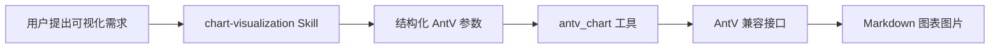

# dsh-plugin-chart

[English](README.md) | 简体中文

这是一个面向 [DeepSeek Harness](https://github.com/deepseek-ai/deepseek-harness) 的非官方社区插件。项目将 AntV [`chart-visualization`](https://github.com/antvis/chart-visualization-skills/tree/master/skills/chart-visualization) Skill 的改编内容内置到代码中，并提供原生 `antv_chart` 工具。

Skill 帮助模型在 24 种图表中选择合适类型并构造数据；工具负责调用 AntV 兼容的 GPT-Vis 接口，内置取消、超时、响应大小限制、返回值校验和 Markdown 图片渲染。用户不需要手工复制 `SKILL.md`，模型也不需要通过 `curl` 调接口。

> [!IMPORTANT]
> 本项目与 DeepSeek、AntV 没有官方隶属或背书关系。DeepSeek Harness 目前仍处于开发者预览阶段，插件 API 可能发生不兼容变化。

## 工作原理



安装这个组合包后会注册两个能力：

- `chart-visualization`：支持模型自动触发和用户显式调用，内容作为代码常量内置在插件模块中。
- `antv_chart`：面向模型的工具，发送图表参数并把返回的图片 URL 渲染成 Markdown。

## 环境要求

- Node.js `^22.19.0` 或 `>=24.0.0`
- `PATH` 中可用的 pnpm（`dsh plugin` 需要）
- DeepSeek Harness `0.1.0-rc.7` 到当前 `0.1.x` 开发者预览版本

## 安装

包发布到 npm 后：

```sh
dsh plugin --profile web add dsh-plugin-chart
```

从源码目录开发安装：

```sh
git clone <你的仓库地址> dsh-plugin-chart
cd dsh-plugin-chart
pnpm install
dsh plugin --profile web add .
```

DeepSeek Harness 会把 `add .` 锚定到当前源码目录，并自动将包内的 `cordis.patch.yml` 加入所选 profile 的组合层。

当前开发者预览版本可能会显示 pnpm 警告，称 profile 自身缺少 `@deepseek-ai/cordis`、`@deepseek-ai/dsh-skill` 和 `@deepseek-ai/dsh-tools` peer。Harness 启动器会通过它维护的 `$DSH_HOME/profiles/node_modules` 后备目录提供这些宿主包，不要只为消除警告而在 profile 中重复安装。可以运行 `dsh --profile web --dump-config`，确认存在启用的 `dsh-chart` 配置行。

启动 Web profile：

```sh
dsh web
```

卸载：

```sh
dsh plugin --profile web remove dsh-plugin-chart
```

## 使用

可以直接用自然语言：

```text
把月活用户做成折线图：1 月 120，2 月 148，3 月 173。
```

也可以显式调用 Skill：

```text
/chart-visualization 对比产品营收：Alpha 42，Beta 31，Gamma 27。
```

模型会加载 Skill、调用 `antv_chart`，最后返回 Markdown 图片。当前支持：

`area`、`bar`、`boxplot`、`column`、`dual-axes`、`fishbone-diagram`、`flow-diagram`、`funnel`、`histogram`、`liquid`、`line`、`mind-map`、`network-graph`、`organization-chart`、`pie`、`radar`、`sankey`、`scatter`、`spreadsheet`、`treemap`、`venn`、`violin`、`waterfall` 和 `word-cloud`。

## 配置

默认接口为 `https://antv-studio.alipay.com/api/gpt-vis`。如果需要接入私有兼容网关或修改限制，在 `$DSH_HOME/profiles/web/cordis.patch.yml` 中覆盖组合包配置行：

```yaml
- id: dsh-chart
  config:
    endpoint: https://charts.example.com/api/gpt-vis
    requestTimeoutMs: 30000
    maxResponseBytes: 65536
```

| 字段               |                 默认值 | 说明                                                                     |
| ------------------ | ---------------------: | ------------------------------------------------------------------------ |
| `endpoint`         | AntV 公共 GPT-Vis 接口 | 接收图表参数的 HTTP(S) 地址；本地开发允许 HTTP，URL 中禁止内嵌账号密码。 |
| `requestTimeoutMs` |                `30000` | 正整数请求超时，最大 `300000`；请求会响应 Harness 的取消信号。           |
| `maxResponseBytes` |                `65536` | 最大响应体字节数，范围为 `1024` 到 `10485760`。                          |

插件会强制把外发请求的 `source` 字段设置为上游接口要求的 `chart-visualization-skills`，模型传入的同名字段不会覆盖它。

## 数据与隐私

工具会把完整的 `spec` 对象发送到配置的接口。不要放入密码、访问令牌、私钥、证件号码、完整个人联系方式或不必要的敏感业务记录。敏感数据应先聚合、匿名化，或改用私有兼容端点。

插件本身不读取或传输 API 凭证。生成图片的 URL 可能托管在接口服务方，保留和访问策略以服务方规则为准。

## 开发与验证

```sh
pnpm install
pnpm check
```

| 命令                 | 用途                                        |
| -------------------- | ------------------------------------------- |
| `pnpm test`          | 运行单元测试与真实注册表集成测试。          |
| `pnpm test:coverage` | 运行测试并检查覆盖率门槛。                  |
| `pnpm typecheck`     | 在严格模式下检查源码和测试。                |
| `pnpm build`         | 生成 ESM JavaScript 和声明文件。            |
| `pnpm format`        | 使用 Prettier 格式化。                      |
| `pnpm check`         | 依次验证格式、类型、覆盖率、构建和 npm 包。 |

集成测试会挂载真实的 `SkillRegistry`、`SystemPrompt` 和 `ToolRuntime`，加载内置 Skill，再通过模拟 HTTP 接口调用 `antv_chart`。

## 上游同步

`src/skill.ts` 中的内置 Skill 内容改编自 AntV 的 MIT 许可文件 `skills/chart-visualization/SKILL.md`。固定的上游提交记录在源码及 [`THIRD_PARTY_NOTICES.md`](THIRD_PARTY_NOTICES.md) 中。

## 发布

1. 更新 `package.json` 版本。
2. 运行 `pnpm check` 与 `npm pack --dry-run`。
3. 在仓库和 npm 包配置完成后发布生成的包。

正式发布前，请在 `package.json` 中补充你自己的仓库地址和 issue tracker。

## 许可证

[MIT](LICENSE)。第三方署名见 [THIRD_PARTY_NOTICES.md](THIRD_PARTY_NOTICES.md)。
